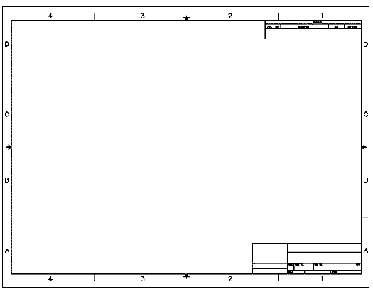

Title: Celebrating Title Blocks
Date: 2021-02-23
Tags: Personal, Notes

I learnt an interesting life lesson from one of the faculty who taught __Engineering Drawing: Computer Aided Design__ in my 2nd year at university. When the classes got too rowdy and a lot of students had lost concentration, he would keep reminding us about the tests and exams.
> "You guys not listening now will **celebrate title blocks** during the exam!"

When the midterms rolled around the lab was deadly quiet
as we all dug into our engineering drawings on AutoCad, some of us for the first time on our own. As the exam went on he'd walk around looking at our screens, and make these sort of comments on our progress.
> "While some people are done with the first drawing, some of you are still **celebrating title blocks!**"
    
For some context, here's a title block at the bottom right corner of this engineering drawing sheet. We use them to label and record key details about the work, metadata if you would. The convention is probably to start off with it, although I know some folks who would rather get the drawing out of the way first.   

Either ways, the point was that although a necessary step, title blocks were a detail only valuable with a completed drawing. After the early stages of the exam you should have moved into the actual drawing material - if you completed the title block and never drew anything else, you'd fail.

It's easy to fall into that trap in real life. If we get caught up in the planning or minor wins we can  forget that the action, when the rubber meets the road is in **more doing**: getting traction, not just launching an application. Figuring out a sustainable business model - not just receiving funding. The 15 - 20 repetitious customer interviews after the first interesting ones that you need to actually start seeing patterns during customer discovery. 

I can't guarantee that the dopamine rush is better when you wait till you've finished a workout or skill acquisition program before posting pictures of your gear/you hard at work but...here's my drift...stop celebrating title blocks.

