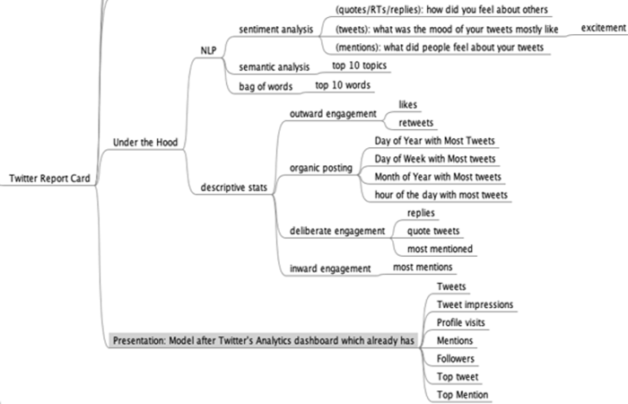

Title: Table Stakes: Should Twitter have an End of The Year Round-up?
Date: 2021-01-13
Category: Product Management
Tags: Product Management

When I saw people tweet their 2020 recaps from [Spotify](https://2020.byspotify.com/) and [Apple Music](https://replay.music.apple.com/), I wondered if Twitter's product team observed this cross-platform sharing and what implementing something similar with already existing data assets would look like. Maybe an **End of the Year report**? 

With consumer technology we often see once unique features quickly become _the minimum offering needed to meet customer expectations_. Stories which started off on Snapchat are a great example of these table stakes. I think showing users their platform usage analytics will soon be ubiquituous, and "End of the Year Reviews" are a great use case as folks get more introspective as they wrap up the year.

If a feature from one platform is shared across others it's usually a good signal - users liked it enough to share wherever they had an existing or larger network. Back in the day before Twitter had native photo sharing it was possible to share & view Instagram photos but that [was taken away](https://www.washingtonpost.com/business/technology/instagram-pulls-photos-from-twitter-completely/2012/12/10/8a23bb4a-42cb-11e2-8061-253bccfc7532_story.html), to keep users viewing photos mainly on the platform where they were originally posted. Sound business logic, too.

Although Twitter's Analytics page isn't visible front and center to the average user, it already has reporting features like descriptive stats, so adding on some cool natural language processing e.g Sentiment Analysis, Semantic Analysis and Bag of Words could yield some interesting results. While I make time to prototype this, here's my mindmap of how it would work under the hood.

My hunch from daily interaction with users, is people could pay for it too.