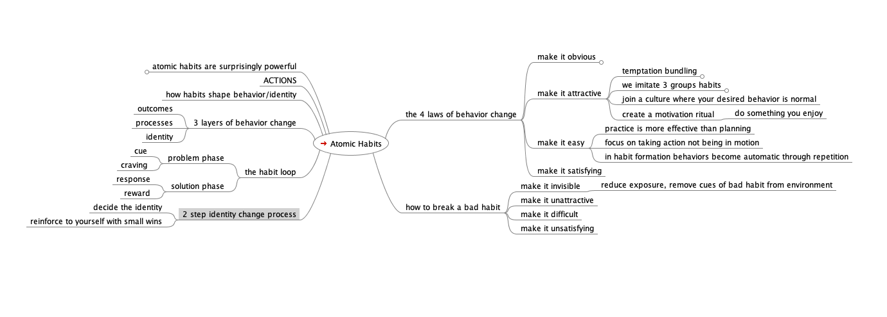

Title: Atomic Habits
Date: 2020-01-31
Date: 2021-02-28
Category: Reading
Tags: Reading

This read took a while because I was mindmapping my notes, but what a great start to the year. Everyone knows the power of habits, but this deconstructed a lot of specific things about them for me.

 Major takeaways were

- **habit stacking**: chaining various activities together to make them sticky habits - _I started a 10pm brush your teeth/plan your 6 top items for the next day routine._

- **planning a fixed time and place** for habits you're trying to develop - 
    _This worked really well for yoga, running, reading and painting this year._

