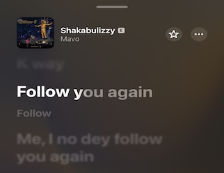

Title: Follow you again.
Date: 2025-10-20
Category: notes
Tags: chunitycard

> "Follow you again. Me I no go follow you again."

One way I’ve learned to deal with social media is to aggressively curate my feeds and optimize for my interests.

I also try my best to filter out negative material and preserve my headspace.

This means that if I repeatedly get a bad vibe from your content, no hard feelings but me I no go follow you again.

Now, a bad vibe doesn’t always mean you did anything wrong. Sometimes it could even just be my own ego, insecurity or envy jumping out, but whatever it is, I won’t entertain it in my personal space.

So if your social media content disrupts or pollutes my headspace, kills my vibe? Me I no go follow you again.

P.S If you like Afrobeats, I listened to this young kid called Mavo so many times over the last few weeks that I made a playlist. More on why on earth I like his music, later.

<iframe allow="autoplay *; encrypted-media *;" frameborder="0" height="450" style="width:100%;max-width:660px;overflow:hidden;background:transparent;" sandbox="allow-forms allow-popups allow-same-origin allow-scripts allow-storage-access-by-user-activation allow-top-navigation-by-user-activation" src="https://embed.music.apple.com/us/playlist/best-of-mavo/pl.u-V9D77MdH3MkL13"></iframe>