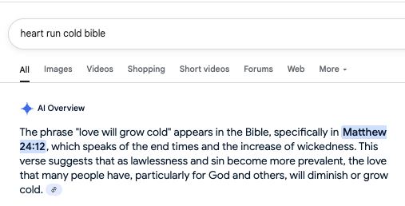

Title: Hearts run cold
Date: 2025-07-14
Category: notes
Tags: notes

“In America, you don’t just visit people. You have to call them in advance to let them know your plans.” my older cousin said. 

This was part of a gradual process of reorientation to the norms of the more individualistic west, after moving from 22 years of having a strong community of family, friends and associates, where being in the neighborhood was a good enough reason to stop by unscheduled.

Even with friends that moved around the same time I did, I saw relationships morph over time as these norms codified. Eventually, you get so used to not wanting to depend on or inconvenience others that your tolerance for being inconvenienced drastically reduces. 

This manifests in many ways, from slight irritation, to flat out refusing to be imposed on. Giving money is fine, it’s usually a token that doesn't really inconvenience you. Time however, or your space is another thing.

Several times this summer, I have caught myself resenting being inconvenienced, and had to take a step back to wonder if my heart is growing cold like in Matt 24:18.
 

Am I losing my values of community? Is my comfort really more important than playing a role in another person’s wellbeing? 

My sister mentioned recently that the price of community can sometimes be inconvenience, and it was a reminder to be grateful to have people who can count on me.