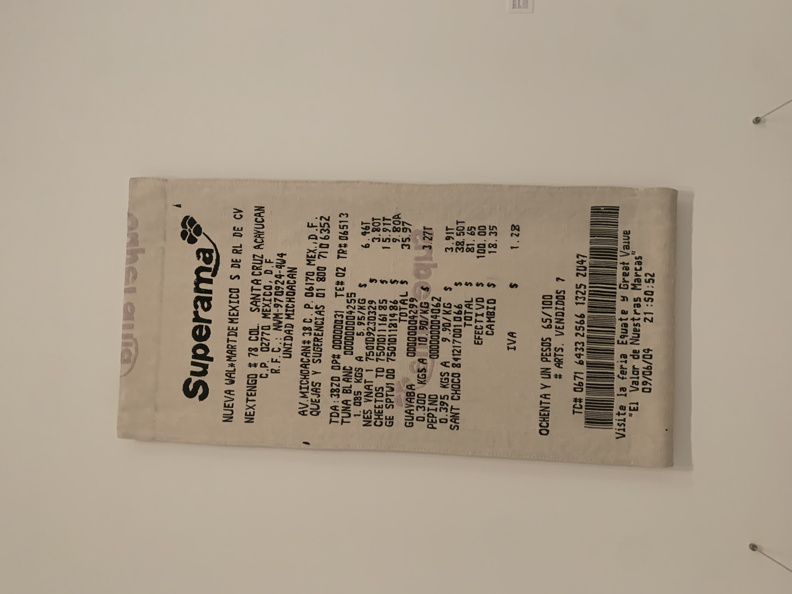

Title: Ontology of a Receipt
Date:  2020-02-26
Status: Draft
Tags: Information Systems

I find receipts fascinating.  Before I started working on retail systems i'd never paid much attention to just how much information was on an everyday item. Seeing this  at the modern art museum was another reminder that I had wanted to write something long form about receipts.

The ontology of a receipt - how all the random information on a receipt makes business sense.