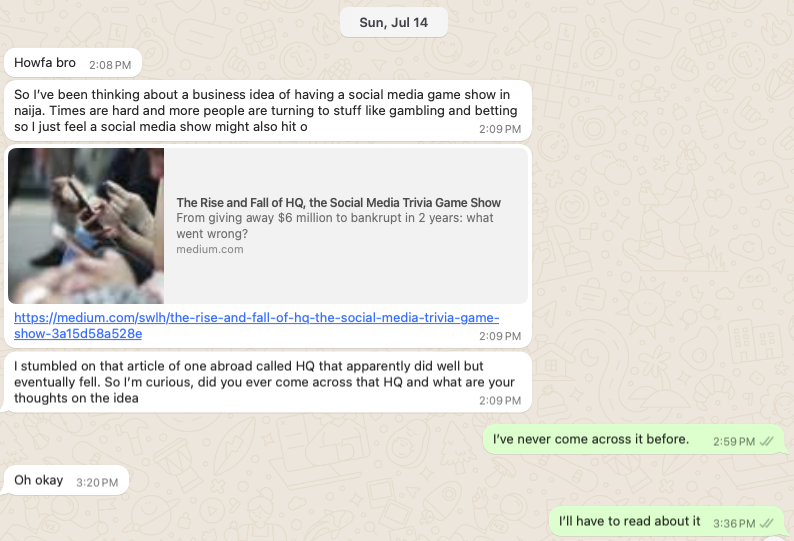

Title: A Social Gameshow
Date: 2024-07-28
Category: notes
Tags: product

Victor sent me a random WhatsApp message one Sunday

He referenced a social media gameshow called HQ <https://medium.com/swlh/the-rise-and-fall-of-hq-the-social-media-trivia-game-show-3a15d58a528e> which I never got around to reading - somehow, I wasn’t convinced.

But a week later I got thinking, How about a trending topic social media game show, exclusively on twitter? (I’ll never call it X)

__It would have some parts__

**First**, a trending topic is chosen and summarized, with a list of the top 2/3 view points. This post also has a poll, so users can pick a side.
The winning side is announced after the poll runs its course. 

**Next**, players can now respond in-thread with their best defense of the winning position. Other users can vote by liking a post. The top 3 liked posts in-thread, within the alotted game time can now be announced as winners, and added to a final poll.

**In this last poll**, users can vote like before, but the 3 winners liked posters will have to select their top explanation from the other 2 posts.
The winner would have the highest votes from the majority and peers.

Here are some reasons why it could work.

- Most news and issues break on twitter and then filter down to other social media.

- There’s a court of public opinion, and for any major issue, at least two sides of the debate always exist, with passionate supporters. 

- Going back to newspaper stands, there’s an existing culture of public dialogue and debate of news and trending topics.

- It’s relatively low-effort to test out.

How I would go about it would be: 
- build a list of topics
- partner with an influencer to soft-launch the game with their posts([@danielregha](https://x.com/DanielRegha) is my pick)
- figure out a revenue model
- iterate on branding
- look for sponsors