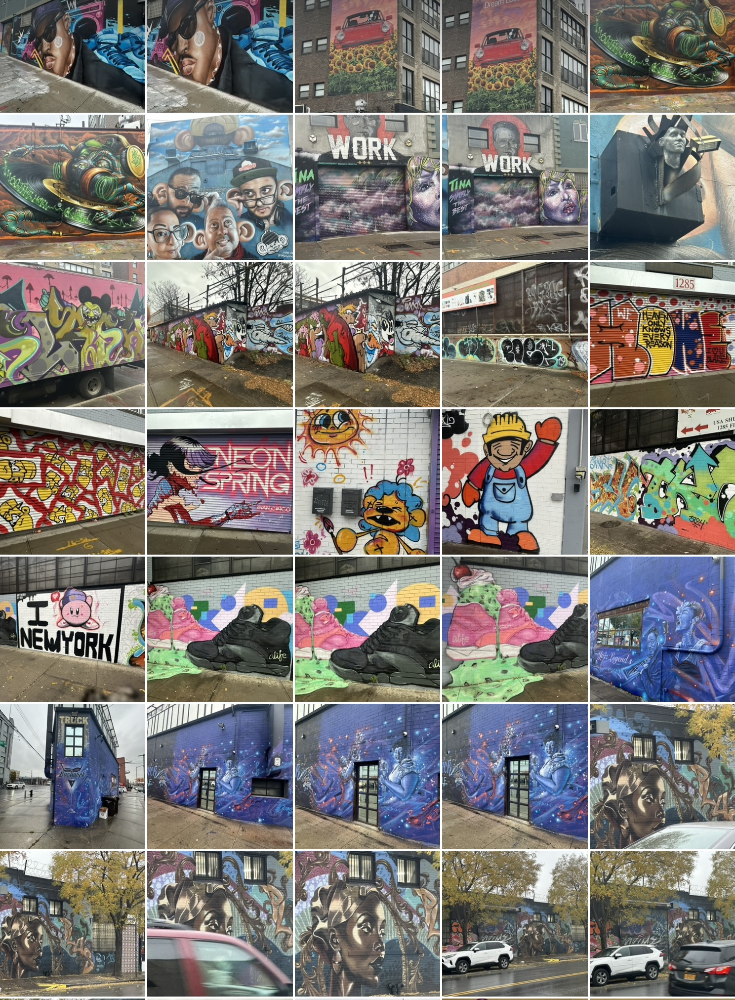

TItle: Flaneur
Date: 2023-11-27
Category: notes
Tags: notes, #Ship30for30

One of my favorite pastimes is to take long walks. Especially those ones where the primary aim isn’t getting somewhere quickly, but instead to discover things along the way. So, when I learned the meaning of the word Flaneur i was pleased to find an apt label that captured that exact experience.

Good ol' [wikipedia says that](https://en.wikipedia.org/wiki/Fl%C3%A2neur) Flâneur derives from the Old Norse verb flana, “to wander with no purpose” and is a French noun referring to a person who is a stroller, lounger or loafer. I definitely identify as one.

For me it’s been a great way to explore a new city or area, think through an idea or two, work out something puzzling or troubling, have a conversation with a friend, or even just walk off a heavy meal. I’ve even listened to books or lectures while walking somewhat aimlessly.

Cities that allow you do this expansively are high up on my list, especially when there’s art or history to feed your eyes whilst at it.
Yesterday, I walked through Bushwick with a friend and photographed graffiti, mainly from [the bushwick collective](https://madhattersnyc.com/blog/best-bushwick-collective-street-art) and it turned out to be a great pick for a photo walk on an otherwise gloomy day.

Even though I vaguely recall from biology that walking and talking are so natural for humans, I was still surprised by how pleasant and refreshing something so simple could be. It really should be a no-brainer for me to be a flaneur more often, even without company.

 ,